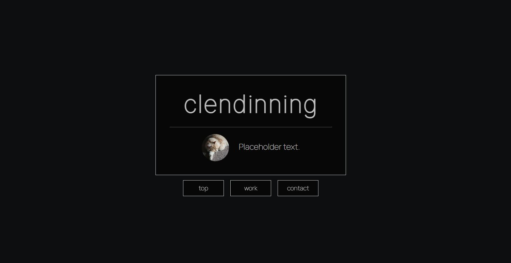

# clendinning1 Portfolio
## Description
clendinning1's portfolio.
## Usage
### Deployed site
(https://clendinning1.github.io/clendinning-portfolio/)
### Website Preview

## Credits
### Content Sources
- Google Fonts: [Inter](https://fonts.google.com/specimen/Inter), [Manrope](https://fonts.google.com/specimen/Manrope)
- [Font Awesome](https://fontawesome.com/) icons
- [Normalize.css](https://necolas.github.io/normalize.css/)'s button formatting for reset.css
- Code for scrollbar from [this W3 page](https://www.w3schools.com/howto/howto_css_custom_scrollbar.asp)
- A small bit of code from [this Stack Overflow answer](https://stackoverflow.com/questions/10995165/what-is-the-opposite-of-hover-on-mouse-leave)

### Information Sources
- [MDN](https://developer.mozilla.org/en-US/)
- [W3](https://www.w3schools.com/)
- [Flexbox Froggy](https://flexboxfroggy.com/) :)
- Stack Overflow: [1](https://stackoverflow.com/questions/2906582/how-do-i-create-an-html-button-that-acts-like-a-link) | [2](https://stackoverflow.com/questions/9189810/css-display-inline-vs-inline-block) | [3](https://stackoverflow.com/questions/11501025/div-anchors-scrolling-too-far)

### Tools Used
- https://www.colorhexa.com/